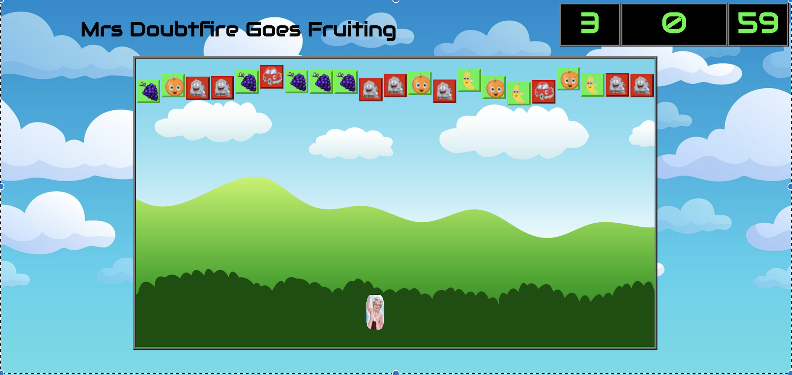

# **_Welcome To Mrs Doubtfire Goes Fruiting_**

The game was based on a memorable scene in the movie itself (a scene in which Mrs Doubtfire throws a piece of fruit at a man that her wife was dating... hilarious!).

That was my inspiration for this game.

This is my first project at General Assembly in which this game was created from scratch using the following technologies:

### ***TECHNOLOGIES USED***

* 	HTML
*  CSS
*  JavaScript (ECMA6)
*  JQuery
*  Zsh
*  Git
*  Github
*  Heroku

### ***Installation***

Access online via these links:

[GitHub](https://github.com/avadher510/project_1_mrs_doubtfire)

HEROKU

***OR***

Install Locally by downloading or cloning the GitHub repository here: [GitHub Repository](https://github.com/avadher510/project_1_mrs_doubtfire)

### ***Challenges***

This project was challenging in various ways. An example of this is in the planning process, I created pseudocode to map out every step of the game. However upon game creation I realised that some of my game actions were too broad and required multiple steps to achieve the desired functionality. This was a key part in collision detection and the consequences that immediately occurred. 

Another challenge faced was DRY-ing up my code. A key example was when the .pieces fell from the top of the game area - originally I had manually created a set interval for every div individually. This consequently, during the DRY-ing up process led to my implementing a loop in which the div's were cycled through and a unique time and margin set upon them so that the game pieces moved differently every time. This also led to making the game more scalable as to adapt speed etc., there is now a single block of code to alter. 

### ***Scaling the Game***

Where next - a key question which I kept in mind during the development process to ensure scalibility of the game.

**The creation of responsiveness** - this is the 1st area of focus as it is key to the user experience of the game. The difference here will be the introduction of small buttons to allow the user to navigate the main game piece easily. Also, few divs will be displayed at any one time. But will generate divs at regular intervals to ensure the user experience is maintained.

**The creation of multiple levels** - this will allow the user to experience different complexities and challenges. The second level to be created is to reduce the number of top divs but also add divs that will from right to left. Therefore, level 1 focuses on the users ability to navigate with objects on the Y-axis, level 2 bring boths the X and Y-axis into play. Subsequent levels will include speed increases, more divs, addition of other objects that cause different actions (power ups).

